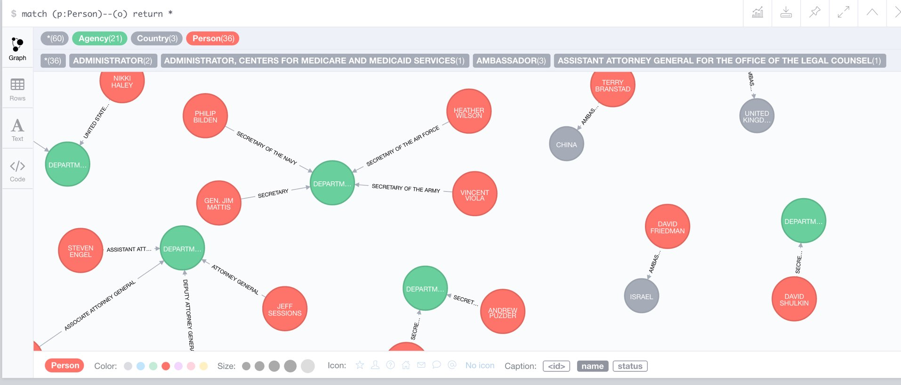

= Key Administration Positions

== Scraping

Using the https://www.washingtonpost.com/graphics/politics/trump-administration-appointee-tracker/database/[Tracker Database of the Washington Post], we can scrape the confirmed key-positions from the table, using some jquery.

The annoying bit are the nested table and the inconsistent structure. 
It would be good to get access to the original data.

Or does anyone know an scraper that takes an URL and a table selector and returns that table as CSV ?

----
var $tables = $("table.agencies");
var data = $tables.map(function() { 
   var isText = function() { return this.nodeType == 3; }
   var text = function() { return $(this).text().trim(); }
   var ctext = function() { return $(this).find("*").andSelf().contents().filter(isText).map(text).toArray().join("\t"); }
   var texts = function (x) { return x.map(ctext).toArray() };
   var $table=$(this); 
   return { 
      header: texts($table.find("thead tr th")), 
      data: $table.children("tbody").children("tr[data-has-nominee=true]").map(
         function() { return [[$(this).parent().attr("id")].concat(texts($(this).children("td")))]; }).toArray()
   }
}).get(0);
data.data.map(function(row) { return row.join("\t") }).join("\n");
----

We can save the text into a CSV to create our graph from.

== CSV Listing

.Confirmation Process by the Washington Post
image::https://www.washingtonpost.com/graphics/politics/how-confirmations-work/img/cabinet-process-flowchart-big-1000.jpg?c=479[]

Then we can list the postions:

[source,cypher]
----
include::trump-nominees.cypher[tags=listpositions]
----

.Here just the secretaries of the departments in different statuses
----
╒═════════════════════════════════════════════╤════════════════════╤════════════════════╤═══════════╕
│"agency"                                     │"status"            │"name"              │"position" │
╞═════════════════════════════════════════════╪════════════════════╪════════════════════╪═══════════╡
│"DEPARTMENT-OF-STATE"                        │"CONFIRMED"         │"REX TILLERSON"     │"SECRETARY"│
├─────────────────────────────────────────────┼────────────────────┼────────────────────┼───────────┤
│"DEPARTMENT-OF-AGRICULTURE"                  │"ANNOUNCED"         │"SONNY PERDUE"      │"SECRETARY"│
├─────────────────────────────────────────────┼────────────────────┼────────────────────┼───────────┤
│"DEPARTMENT-OF-COMMERCE"                     │"ANNOUNCED"         │"WILBUR ROSS"       │"SECRETARY"│
├─────────────────────────────────────────────┼────────────────────┼────────────────────┼───────────┤
│"DEPARTMENT-OF-DEFENSE"                      │"CONFIRMED"         │"GEN. JIM MATTIS"   │"SECRETARY"│
├─────────────────────────────────────────────┼────────────────────┼────────────────────┼───────────┤
│"DEPARTMENT-OF-EDUCATION"                    │"CONFIRMED"         │"BETSY DEVOS"       │"SECRETARY"│
├─────────────────────────────────────────────┼────────────────────┼────────────────────┼───────────┤
│"DEPARTMENT-OF-ENERGY"                       │"ANNOUNCED"         │"RICK PERRY"        │"SECRETARY"│
├─────────────────────────────────────────────┼────────────────────┼────────────────────┼───────────┤
│"DEPARTMENT-OF-HEALTH-AND-HUMAN-SERVICES"    │"CONFIRMED"         │"TOM PRICE"         │"SECRETARY"│
├─────────────────────────────────────────────┼────────────────────┼────────────────────┼───────────┤
│"DEPARTMENT-OF-HOMELAND-SECURITY"            │"CONFIRMED"         │"GEN. JOHN F. KELLY"│"SECRETARY"│
├─────────────────────────────────────────────┼────────────────────┼────────────────────┼───────────┤
│"DEPARTMENT-OF-HOUSING-AND-URBAN-DEVELOPMENT"│"ANNOUNCED"         │"BEN CARSON"        │"SECRETARY"│
├─────────────────────────────────────────────┼────────────────────┼────────────────────┼───────────┤
│"DEPARTMENT-OF-LABOR"                        │"WITHDRAWAL PENDING"│"ANDREW PUZDER"     │"SECRETARY"│
├─────────────────────────────────────────────┼────────────────────┼────────────────────┼───────────┤
│"DEPARTMENT-OF-LABOR"                        │"ANNOUNCED"         │"ALEXANDER ACOSTA"  │"SECRETARY"│
├─────────────────────────────────────────────┼────────────────────┼────────────────────┼───────────┤
│"DEPARTMENT-OF-TRANSPORTATION"               │"CONFIRMED"         │"ELAINE CHAO"       │"SECRETARY"│
├─────────────────────────────────────────────┼────────────────────┼────────────────────┼───────────┤
│"DEPARTMENT-OF-VETERANS-AFFAIRS"             │"CONFIRMED"         │"DAVID SHULKIN"     │"SECRETARY"│
├─────────────────────────────────────────────┼────────────────────┼────────────────────┼───────────┤
│"DEPARTMENT-OF-THE-INTERIOR"                 │"ANNOUNCED"         │"RYAN ZINKE"        │"SECRETARY"│
├─────────────────────────────────────────────┼────────────────────┼────────────────────┼───────────┤
│"DEPARTMENT-OF-THE-TREASURY"                 │"CONFIRMED"         │"STEVE MNUCHIN"     │"SECRETARY"│
└─────────────────────────────────────────────┴────────────────────┴────────────────────┴───────────┘
----

== Data Import

Then we can import the actual graph.
We connect the people via their `position` to the agency.
For ambassadors we connect them the the country instead.

[source,cypher]
----
include::trump-nominees.cypher[tags=importpositions]
----

