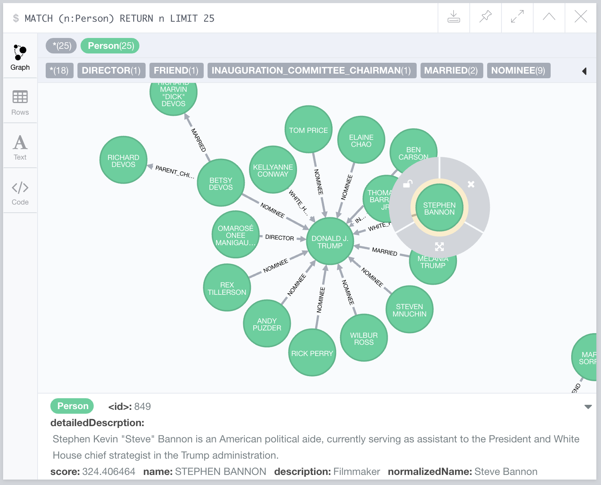
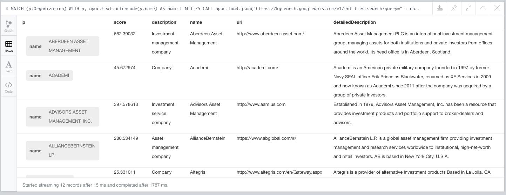

## Google Knowledge Graph

*Thanks to Tomaž Bratanič for [this post](https://tbgraph.wordpress.com/2017/03/07/neo4j-apoc-triggers-and-web-apis/) about using APOC triggers for the idea*.

First, obtain an API key for the [Google Knowledge Graph API.](https://developers.google.com/knowledge-graph/)

## Enriching Person nodes with data from the Google Knowledge Graph

~~~
WITH "YOUR_API_KEY_HERE" AS key
MATCH (p:Person) WITH key, p, apoc.text.urlencode(p.name) AS name
CALL apoc.load.json("https://kgsearch.googleapis.com/v1/entities:search?query=" + name + "&key" + key + "&types=Person&limit=1") YIELD value

WITH key, p,value.itemListElement[0] AS list WHERE list.result.detailedDescription IS NOT NULL 

WITH key, p,list.resultScore AS score, list.result.description AS description, list.result.name AS name, list.result.url AS url, list.result.detailedDescription.articleBody AS detailedDescription

SET p.detailedDescription = detailedDescription, p.score = score, p.description = description, p.normalizedName = name, p.url = url
~~~

## Enriching Organization nodes

~~~
WITH "YOUR_API_KEY_HERE" AS key
MATCH (p:Organization) WITH key,p, apoc.text.urlencode(p.name) AS name 
WITH key,p, name
CALL apoc.load.json("https://kgsearch.googleapis.com/v1/entities:search?query=" + name + "&key="+ key + "&types=Organization&limit=1") YIELD value

WITH key,p,value.itemListElement[0] AS list WHERE list.result.detailedDescription IS NOT NULL 

WITH key,p,list.resultScore AS score, list.result.description AS description, list.result.name AS name, list.result.url AS url, list.result.detailedDescription.articleBody AS detailedDescription

SET p.detailedDescription = detailedDescription, p.score = score, p.description = description, p.normalizedName = name, p.url = url
~~~

