= The TrumpWorld Graph

image::https://img.buzzfeed.com/buzzfeed-static/static/2017-01/13/13/asset/buzzfeed-prod-fastlane-01/sub-buzz-31493-1484333437-1.jpg?no-auto[float=right,width=300]

It all started with Jeremy Singer-Vine and his co-authors publishing a partial dataset of connections between organizations and people around Donald Trump.

The data was made available as a public Google Document, which we imported into Neo4j so that it became queryable and visualizable.

You can access the TrumpWorld Graph live at http://bit.ly/trumpworld (username/pwd - trumpworld/trumpworld)

You can also run the TrumpWorld Guide in any Neo4j Browser by executing `:play http://guides.neo4j.com/trumpworld`

Which cover the import, queries and visualizations and the extension with the federal contract data.

In this repository you can find the different resources and scripts for imports, querying and visualization.

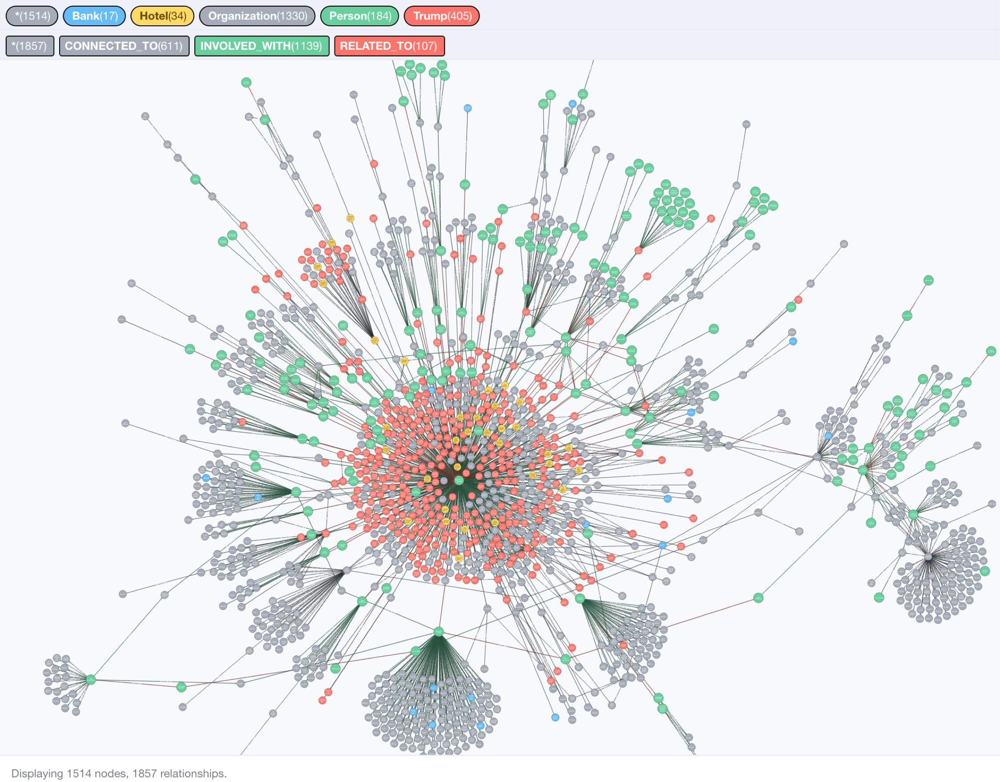

== Current Work

1. TrumpWorld Import & Queries link:01-trumpworld[]
2. Adding US Government Contracting Data link:02-contracts[]
3. Merging OpenCorporates Records link:03-opencorporates[]
4. The Nonprofits of Trumpworld link:04-nonprofit[]
5. Extending Trumpworld with LittleSis - the involuntary Facebook of the 1% link:05-littlesis[]

== Examples

.The Second-Degree Kushner Network
[source,cypher]
----
MATCH network = (:Person {name:"JARED KUSHNER"})-[*..2]-()
RETURN network
----

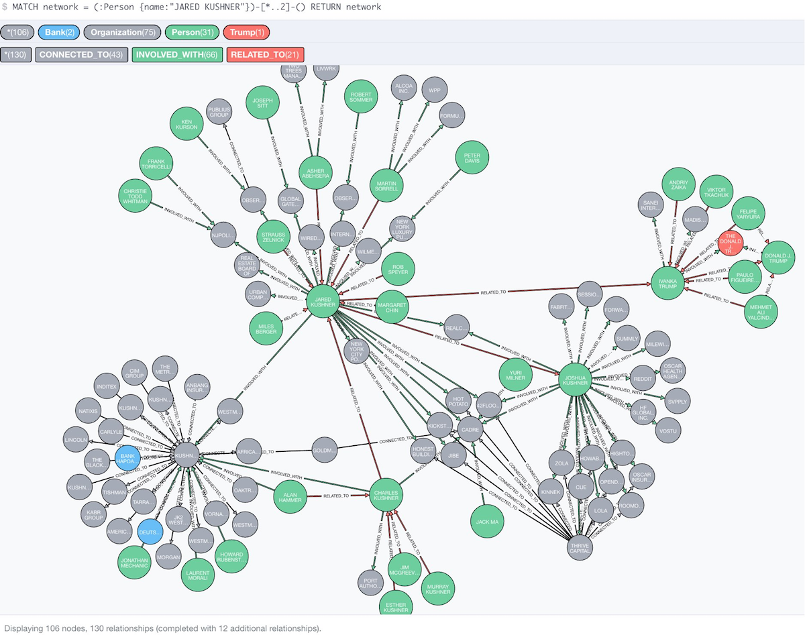

.Nominee Influence
[source,cypher]
----
MATCH (o:Organization)<-[:INVOLVED_WITH]-(p:Person)-[con:RELATED_TO]->()
WHERE con.connection CONTAINS "Nominee"
RETURN o,p
----

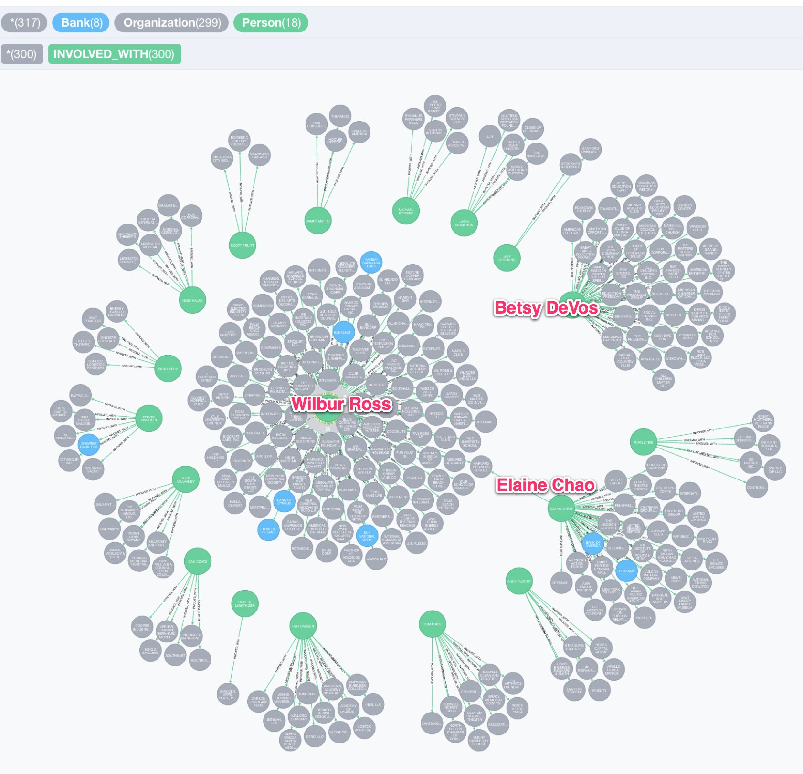

== Publications

* https://www.buzzfeed.com/johntemplon/help-us-map-trumpworld?utm_term=.kd5QM0z1q#.ekLzoZ316[Buzzfeed article "Help us map TrumpWorld"]
* https://neo4j.com/blog/buzzfeed-trumpworld-dataset-neo4j/[Trumpworld Graph in Neo4j] Blog Post by Michael Hunger
* http://www.lyonwj.com/2017/01/30/trumpworld-us-contracting-data-neo4j/[Adding US Government Contracting Data - USASpending.gov] Blog Post by William Lyon
* http://bit.ly/trumpworld[TrumpWorld Database Instance] (username/pwd - trumpworld/trumpworld)
* http://trump.kimalbrecht.com[TrumpWorld Graph Visualization] by Kim Albrecht https://www.fastcodesign.com/3067700/infographic-of-the-day/holy-crap-this-map-of-trumps-business-network-is-terrifying[FastCo], https://www.wired.com/2017/01/kim-albrecht-trump-data-viz/[Wired]

* http://portal.graphgist.org/graph_gists/3b255f1d-509a-4b1c-b8e5-1442efdd036d/[GraphGist TrumpWorld Simple]
* http://portal.graphgist.org/graph_gists/834c8437-f713-420d-8c0b-979a2d067485[GraphGist TrumpWorld Advanced] (needs APOC procedures installed)
* Run GraphGists as browser guides: `:play http://portal.graphgist.org/graph_gists/trumpworld-graph/graph_guide`

* http://www.slideshare.net/lyonwj/finding-insights-in-connected-data-using-graph-databases-in-journalism[NICAR Presentation: Finding Insights In Connected Data: Using Graph Databases In Journalism]

== Next Steps

Collaborate with Brown University, ProPublica, ICIJ, OCCRP, and others to enrich the dataset and find new insights.

== DataSources to Integrate

* http://CitizenAudit.org
* http://www.fec.gov/finance/disclosure/ftpdet.shtml#a2015_2016
* http://campaign-finance.org/
* http://littlesis.org
* https://opencorporates.com/corporate_groupings/Donald+Trump[http://OpenCorporates.com]
* http://USASpending.gov
* https://docs.google.com/spreadsheets/d/1Z5Vo5pbvxKJ5XpfALZXvCzW26Cl4we3OaN73K9Ae5Ss/edit[BuzzFeed Google Doc]
* http://fullcontact.com API
* https://www.govtrack.us/
* https://propublica.github.io/congress-api-docs/

////
Betsy DeVos’s brother, Erik Prince, founded Blackwater, the mercenary outfit that, among other things, helped destabilize Iraq by firing into a crowd of civilians
https://www.nytimes.com/2017/01/20/opinion/donald-the-unready.html

https://twitter.com/funder/status/822663591610511361

https://twitter.com/kenvogel/status/826627157283766272
Trump's campaign paid his companies another $204k after his Election Day victory, according to an @FEC report filed this evening. https://pbs.twimg.com/media/C3jE8ueVYAAPDTA.jpg

https://twitter.com/Khanoisseur/status/822392019649560576

Trump influence graphs
https://www.nytimes.com/interactive/2017/01/20/us/politics/100000004884201.mobile.html

https://www.washingtonpost.com/politics/documents-confirm-trump-still-benefiting-from-his-business/2017/02/04/848fdd5a-eae0-11e6-bf6f-301b6b443624_story.html?utm_term=.772f1af163a7

https://www.washingtonpost.com/news/acts-of-faith/wp/2017/02/02/trump-said-hell-totally-destroy-the-johnson-amendment-what-is-it-and-why-do-people-care/

http://www.politico.com/story/2017/02/trump-campaign-paid-trump-business-234489

https://twitter.com/alt_doj/status/826649154860363777
POTUS started a new company in Florida with Eric on 1/3/17
////

== Visualizations

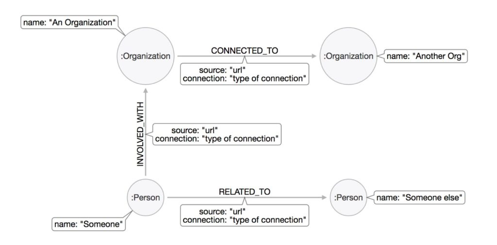

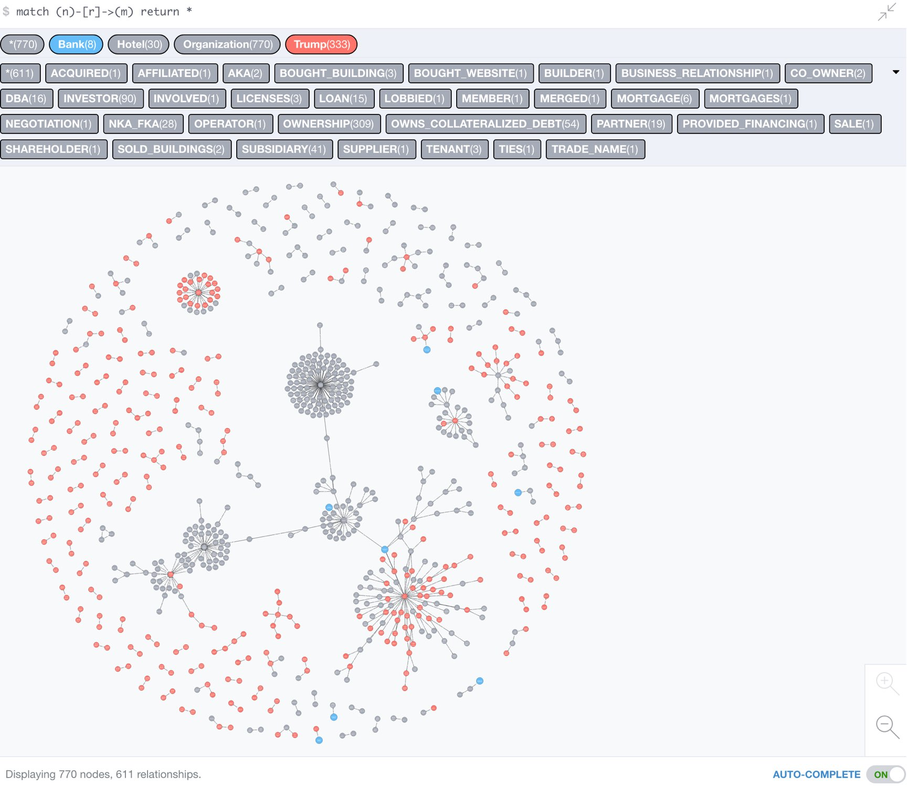

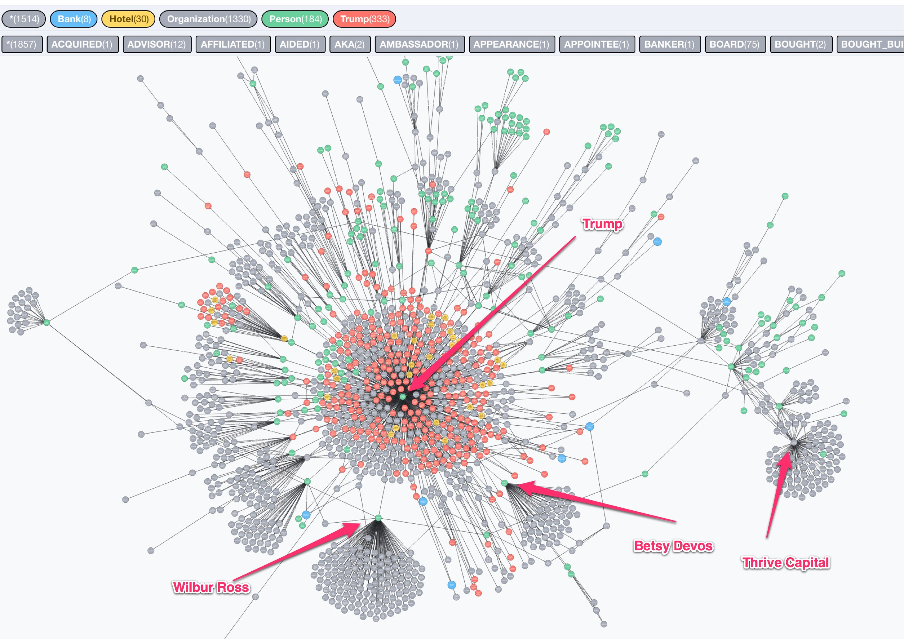

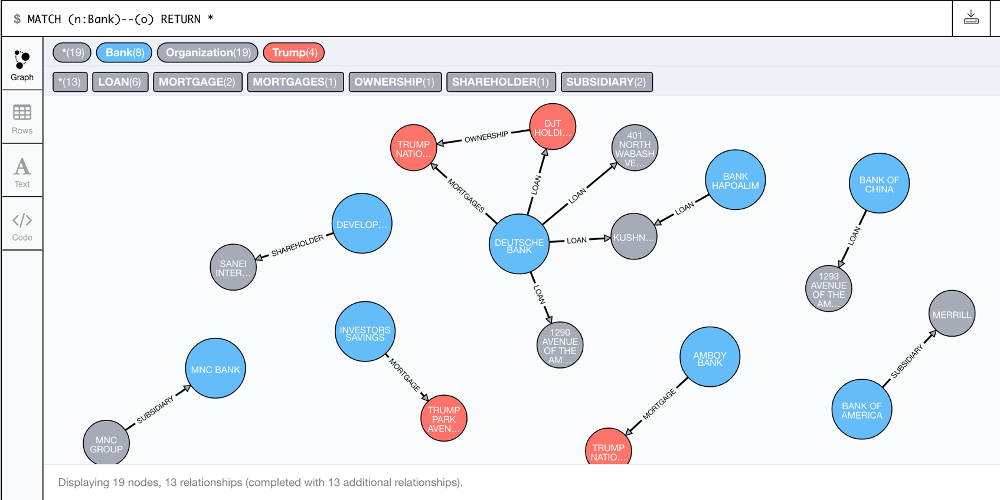

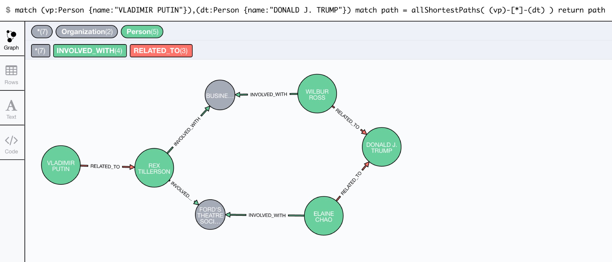

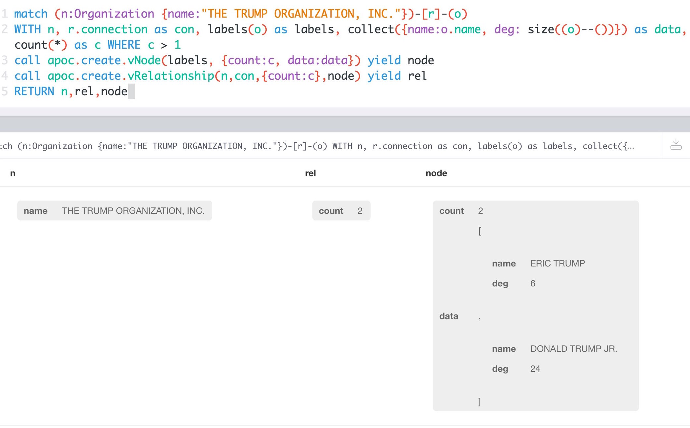

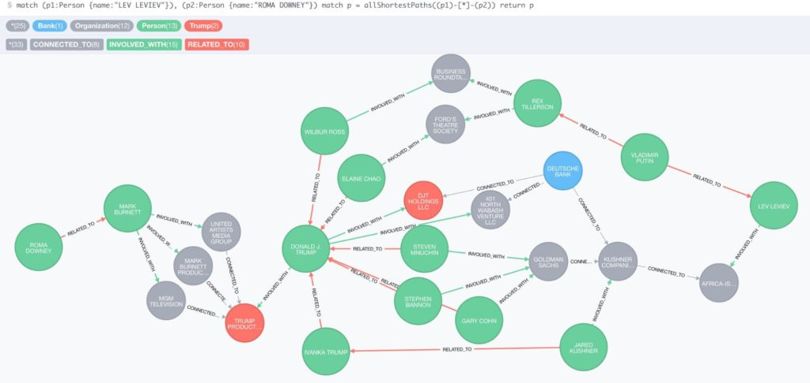

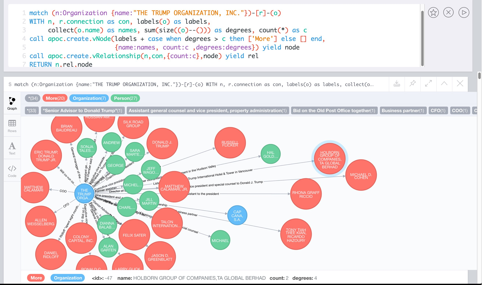

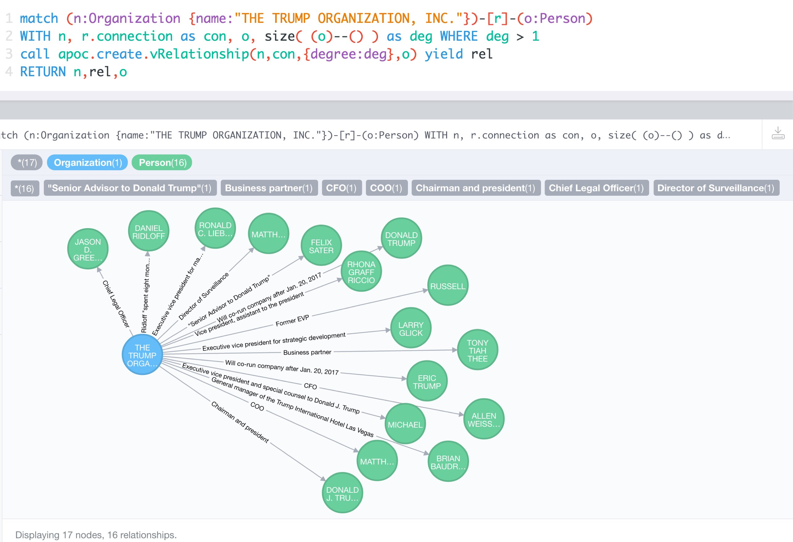

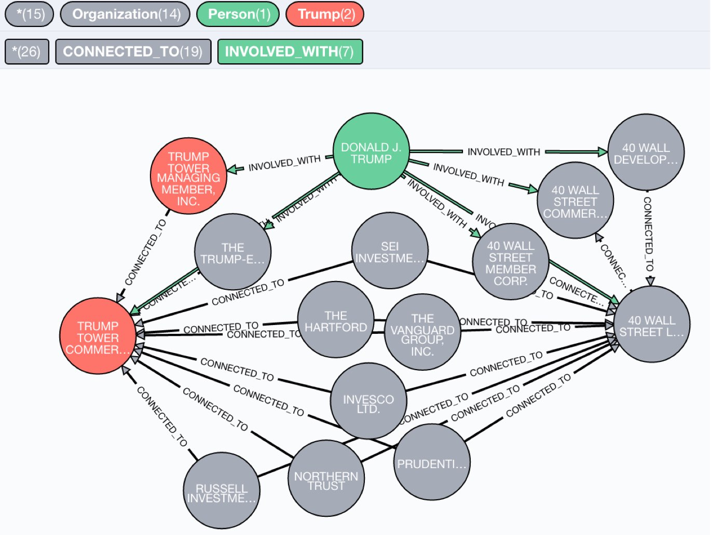

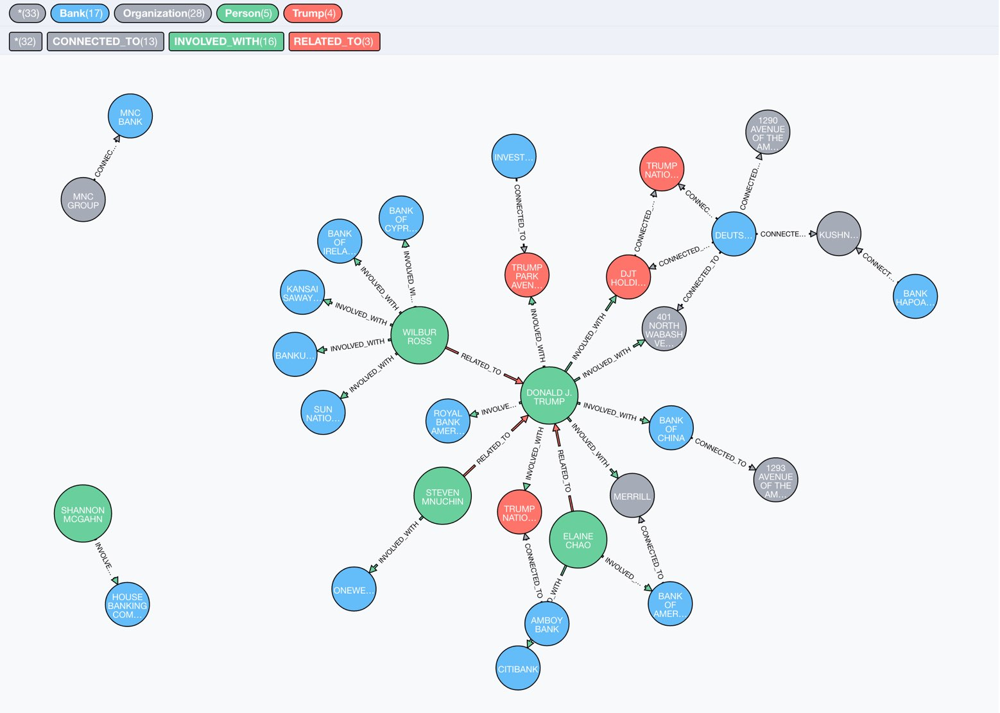

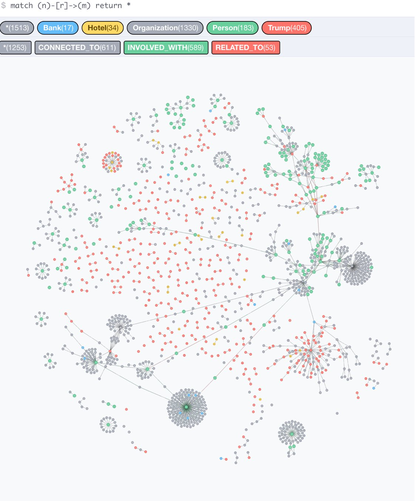

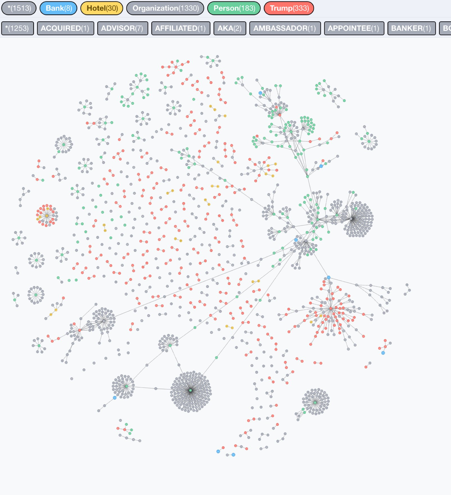
